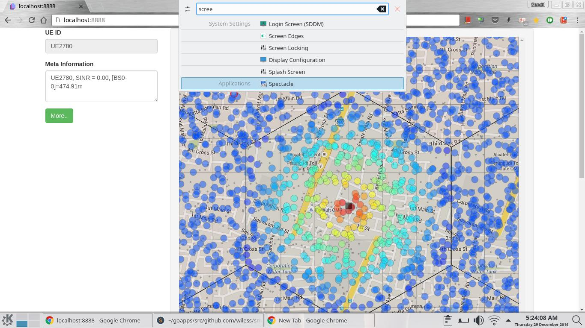

# smallcell
Golang based smallcell wireless simulation and simple web interface for personal research work

## Main Code 
[smallcell.go](smallcell.go) does a deployment and creates a heatmap png file of the deployment. 

## [cmd/](cmd/) 
* folder contains html files to render an svg depicting the deployment of nodes color coded by mapping to its SINR. The output can be downloaded as PNG. Run an  [httpserver](https://gist.github.com/wiless/b97637e1b5625248784d) pointing to this folder as http root.  

* smallcell.slide : A golang presentation slide

